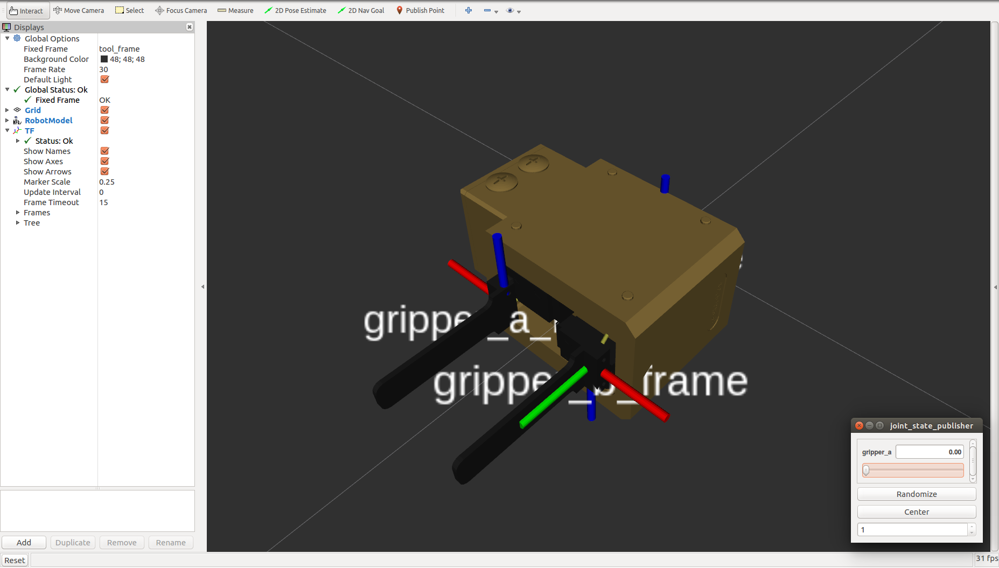

schunk_pg70_description
=========================

ROS package providing a URDF model of the Schunk PG70 gripper

View the gripper in `RViz` by running

    roslaunch schunk_pg70_description display.launch gui:=true

